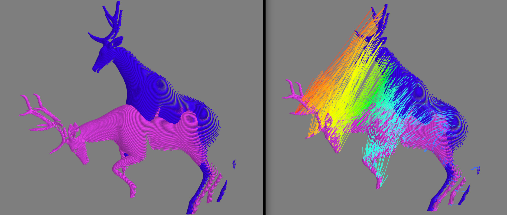

### DeformingThings4D toolkit

The toolkit to generate depth and scene flow from a .anime file
This script is tested on Ubuntu16+ with Blender 2.82. Install [Blender] first.

[Blender]: https://www.blender.org/download/releases/2-82/

### Data Generation
Run the code to generate scene flow from the example.anime file with frame-skip set to 4.
modify camera viewpoint in anime_renderer.py. 
```shell
blender  --background  --python anime_renderer.py -- ./example.anime ./example 4
```
The generate folder structure is as the following:
```text
|--example 
    |--cam_extr.txt  # 4x4 extrinsics
    |--cam_intr.txt  # 3x3 intrinsics
    |--depth
    |   |--0001.png # depth image, uint16, unit: 1/1000 meter
    |   |--0002.png 
    |--sflow
        |--0018_0022.exr # sflow from frame 18 to 22, float32, unit: meter
```

### Visualize the data
To visualize the generated pointcloud & sceneflow, install [Mayavi] first and then modify/run the code
```shell
python parse_flow.py
```

[mayavi]:https://docs.enthought.com/mayavi/mayavi/installation.html

*Left: point cloud from source and target frame, Right: inter-frame scene flow (subsampled)*

